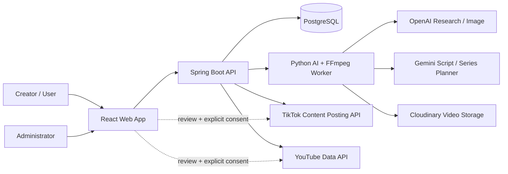
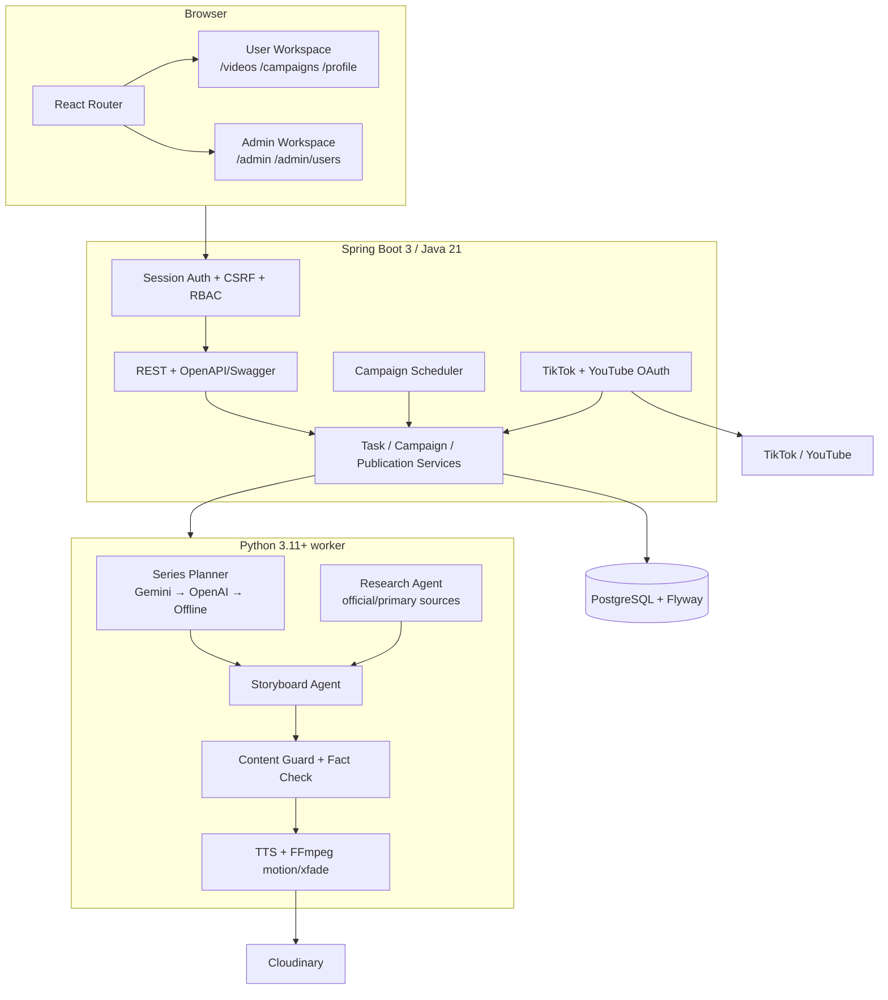
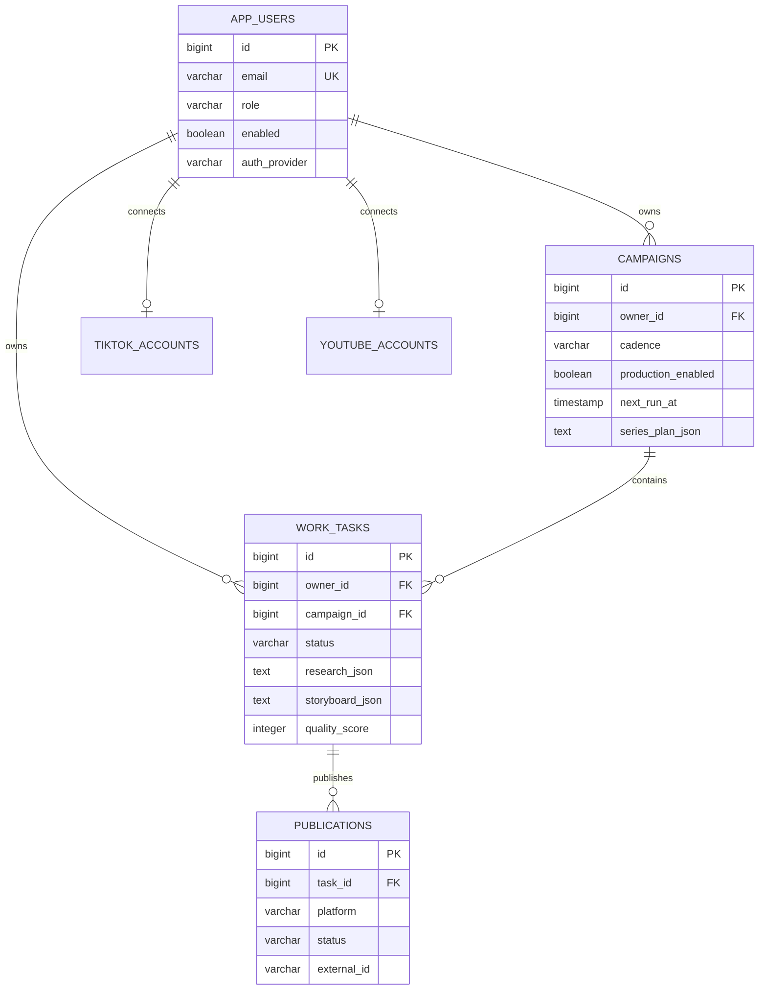
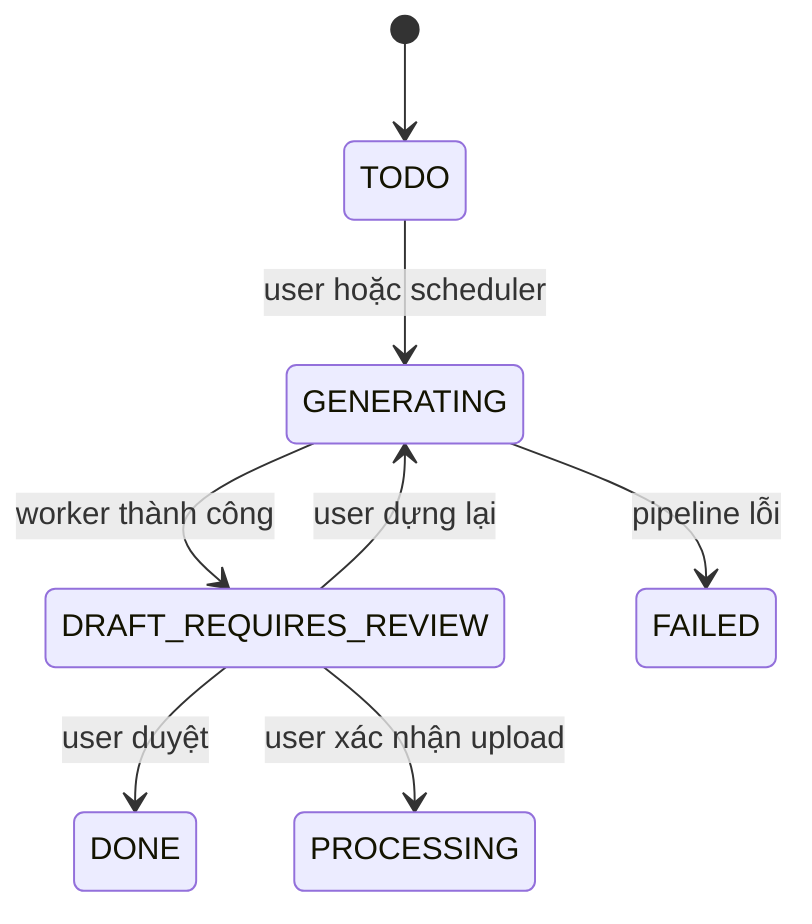

# AI TechFlow Studio — Kiến trúc hệ thống

## Mục tiêu

AI TechFlow là content operating system cho video dọc tiếng Việt. Hệ thống quản lý user, campaign/series, nghiên cứu nguồn, kịch bản nhiều cảnh, dựng video, review và upload có xác nhận. Nguyên tắc bất biến: worker chỉ tạo `DRAFT_REQUIRES_REVIEW`; scheduler không tự xuất bản.

## System context



## Container architecture



## Luồng campaign theo lịch

```mermaid
sequenceDiagram
    actor User
    participant UI as Campaign UI
    participant API as CampaignService
    participant Planner as series_planner.py
    participant DB as PostgreSQL
    participant Scheduler
    participant Worker as video_worker.py
    User->>UI: Tạo chủ đề, audience, nhân vật, cadence
    UI->>API: POST /api/campaigns
    User->>UI: Lên ý tưởng AI
    UI->>API: POST /api/campaigns/{id}/plan
    API->>Planner: theme + audience + episode count
    Planner-->>API: Series Bible JSON
    API->>DB: Lưu series_plan_json
    User->>UI: Tạo danh sách tập
    UI->>API: POST /api/campaigns/{id}/episodes
    API->>DB: Tạo task TODO theo episode
    loop Mỗi phút khi server hoạt động
      Scheduler->>API: Claim campaign đến hạn
      API->>DB: TODO → GENERATING; tính next_run_at
      API->>Worker: Tạo bản nháp
      Worker->>Worker: Research → Script → Guard → FFmpeg
      Worker-->>DB: DRAFT_REQUIRES_REVIEW
    end
    User->>UI: Xem video + nguồn + xác nhận
    UI->>API: Upload TikTok hoặc YouTube
```

## Data model



## Security boundaries

- Session cookie HttpOnly, Secure trên production, SameSite Lax.
- CSRF token bắt buộc cho request thay đổi dữ liệu.
- `/api/admin/**` chỉ dành cho `ROLE_ADMIN`.
- User chỉ đọc/sửa task và campaign của mình; admin quan sát toàn hệ thống.
- OAuth state được gắn với session và owner id.
- TikTok/YouTube token mã hóa AES-GCM bằng `TECHFLOW_TOKEN_ENCRYPTION_KEY`.
- URL media upload chỉ nhận HTTPS từ `res.cloudinary.com`.
- API key/client secret chỉ đi qua environment variables; không lưu trong source, response hoặc log.

## Trạng thái review-first



`PROCESSING` phía cuối là trạng thái `Publication`, không thay thế trạng thái review của `WorkTask`.
