# AI TechFlow Feature Blueprint

## Mục tiêu

AI TechFlow sản xuất video/series có nhân vật nhất quán, research có nguồn, nhiều chế độ âm thanh và nhiều engine chuyển động. Mọi đầu ra đều dừng ở `DRAFT_REQUIRES_REVIEW`; scheduler không tự xuất bản.

## Luồng hệ thống

```mermaid
flowchart LR
  U[User / Admin] --> C[Campaign & Character Studio]
  C --> P[Series Bible + Episode Planner]
  P --> T[WorkTask]
  T --> R[Research Agent]
  R --> S[Storyboard 6-30 cảnh]
  S --> I[Keyframe + Character Reference]
  I --> V{Motion Provider}
  V -->|Ken Burns| K[FFmpeg 2.5D]
  V -->|Seedance / Veo| M[Image-to-Video clips]
  K --> A[Audio Orchestration]
  M --> A
  A --> O[Cloudinary MP4 + SRT + metadata]
  O --> D[DRAFT_REQUIRES_REVIEW]
  D --> H[Human Review]
  H --> Y[TikTok / YouTube user-confirmed upload]
```

## Character & World Consistency

- Campaign lưu `character_image_url` và `character_reference_prompt`.
- Character Studio hỗ trợ AI generation hoặc upload thủ công.
- Episode mới kế thừa reference, mô tả nhân vật và visual style.
- GPT Image edit nhận reference làm image input cho từng scene.
- Episode `TODO`/`FAILED` được đồng bộ khi Character Sheet hoặc Series Bible thay đổi; episode đã sản xuất không bị sửa.

## Storyboard

- 60 giây: tối thiểu 6 cảnh.
- 180 giây: chuẩn 18 cảnh.
- Video dài hơn tăng đến tối đa 30 cảnh.
- Mỗi scene có narration, on-screen text, visual prompt, character action, camera motion, source IDs và duration hint.
- Research/fact-check vẫn áp dụng cho cả narrated và silent animation.

## Audio modes

### Narrated

- Edge TTS tiếng Việt.
- Tạo SRT theo thời lượng từng scene.
- FFmpeg ghép AAC với video.

### Silent animation

- Không gọi TTS.
- BGM procedural không bản quyền được tạo cục bộ.
- Fade-in/fade-out và subtitle dùng on-screen text.
- Kiến trúc cho phép thay BGM/SFX bằng asset library có license sau này.

## Render profiles

| Aspect | Draft | HD | 2K |
|---|---:|---:|---:|
| 9:16 | 540×960 | 720×1280 | 1440×2560 |
| 16:9 | 960×540 | 1280×720 | 2560×1440 |

Motion provider:

- `kenburns`: fallback nhanh, không cần API ngoài.
- `seedance2_fast`: adapter Image-to-Video qua endpoint và API key trên server.
- `veo`: adapter Image-to-Video qua endpoint và API key trên server.

Nếu provider chuyển động chưa cấu hình, worker ghi log có ngữ cảnh và quay về Ken Burns.

## Production configuration

Secrets chỉ đặt trong Render:

- `SEEDANCE2_IMAGE_TO_VIDEO_URL`, `SEEDANCE2_API_KEY`
- `VEO_IMAGE_TO_VIDEO_URL`, `VEO_API_KEY`
- `OPENAI_API_KEY`, `GEMINI_API_KEY`, `CLOUDINARY_URL`

Không ghi secret vào source, log hay metadata video.
