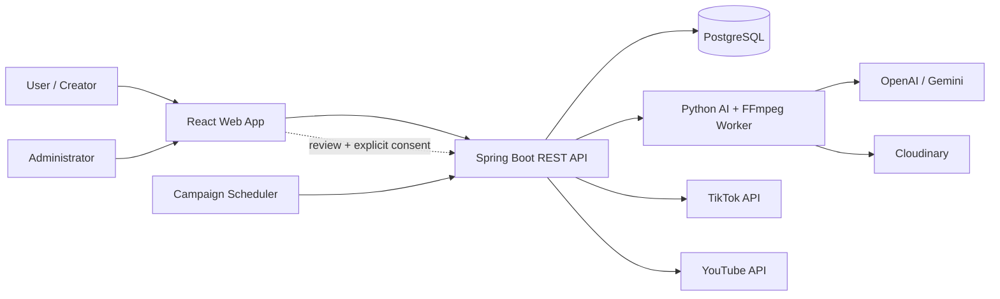
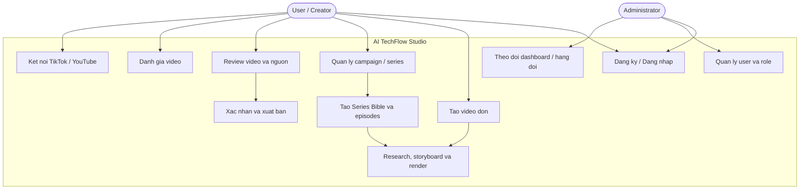
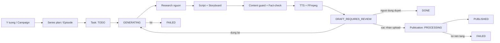
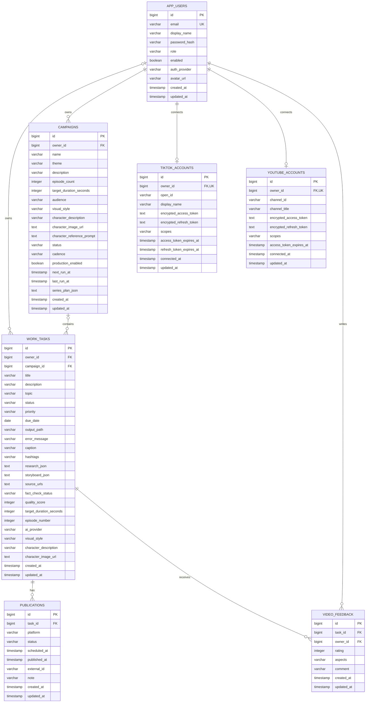

# AI TechFlow Studio - SRS và ERD

## 1. Giới thiệu dự án

### 1.1. Tổng quan

AI TechFlow Studio la he thong quan ly quy trinh san xuat video doc tieng Viet ve
cong nghe, lap trinh va xu huong. He thong ho tro tu luc hinh thanh y tuong, nghien
cuu nguon, tao kich ban va storyboard, dung video bang AI/FFmpeg, review noi dung
den khi nguoi dung chu dong xuat ban len TikTok hoac YouTube.

Nguyen tac cot loi cua he thong la **review-first**: worker chi tao video o trang
thai `DRAFT_REQUIRES_REVIEW`; khong co tien trinh nen nao duoc tu dong xuat ban.

### 1.2. Mục tiêu

- Rut ngan thoi gian san xuat video ngan co nguon va co cau truc.
- Quan ly video don le va chuoi video theo campaign.
- Duy tri nhan vat, phong cach hinh anh va thong diep nhat quan trong series.
- Cho phep van hanh khi khong co API key bang cac che do offline/fallback.
- Luu vet nghien cuu, storyboard, ket qua fact-check va diem chat luong.
- Bao dam moi lan xuat ban deu co thao tac duyet va dong y ro rang cua nguoi dung.

### 1.3. Phạm vi

He thong bao gom:

- Web app React cho nguoi dung va quan tri vien.
- REST API Spring Boot cho xac thuc, nghiep vu va du lieu.
- PostgreSQL luu user, campaign, task, publication, tai khoan kenh va feedback.
- Python worker cho research, lap ke hoach series, tao noi dung va render video.
- Tich hop OpenAI, Gemini, Cloudinary, TikTok va YouTube qua bien moi truong.

Khong thuoc pham vi:

- Tu dong dang video ma khong co review.
- Luu API key hoac OAuth token dang ro trong ma nguon hay co so du lieu.
- Sao chep nguyen van bai bao lam noi dung video.

## 2. Tác nhân và sơ đồ ngữ cảnh

### 2.1. Tác nhân

| Tac nhan | Vai tro |
|---|---|
| User/Creator | Tao campaign, tao video, review, ket noi kenh va xuat ban |
| Administrator | Quan ly user, phan quyen va theo doi toan he thong |
| Scheduler | Chon campaign den han va khoi tao mot episode can san xuat |
| AI/Media services | Ho tro research, script, hinh anh, TTS va luu media |
| TikTok/YouTube | Nhan video sau khi nguoi dung da duyet va dong y |

## 3. Yêu cầu chức năng

| Ma | Yeu cau | Uu tien |
|---|---|---|
| FR-01 | He thong cho phep dang ky, dang nhap local va dang nhap Google | Cao |
| FR-02 | User chi duoc xem va thay doi task/campaign thuoc so huu cua minh | Cao |
| FR-03 | Admin co the xem dashboard tong, quan ly role va khoa/mo user | Cao |
| FR-04 | User co the tao, sua, xoa va yeu cau dung mot video don le | Cao |
| FR-05 | User co the tao campaign gom 1-30 episode, thoi luong 30-600 giay | Cao |
| FR-06 | He thong tao Series Bible va danh sach episode bang AI hoac fallback offline | Cao |
| FR-07 | Scheduler chi claim mot episode `TODO` den han va khong tao trung | Cao |
| FR-08 | Worker thuc hien research, storyboard, content guard, TTS va render FFmpeg | Cao |
| FR-09 | He thong luu nguon, research, storyboard, fact-check va quality score | Cao |
| FR-10 | Video render thanh cong phai o `DRAFT_REQUIRES_REVIEW` | Bat buoc |
| FR-11 | User co the review, sua metadata, gui feedback hoac yeu cau dung lai | Cao |
| FR-12 | TikTok/YouTube upload chi chay khi task hop le va `consent=true` | Bat buoc |
| FR-13 | He thong theo doi tung lan xuat ban va external id cua nen tang | Cao |
| FR-14 | User co the ket noi/ngat ket noi mot tai khoan TikTok va YouTube | Trung binh |
| FR-15 | He thong ghi nhan danh gia 1-5 sao, aspects va comment cho moi video | Trung binh |

## 4. Use case tổng quát

## 5. Quy tắc nghiệp vụ

- BR-01: Moi video do worker tao phai co trang thai `DRAFT_REQUIRES_REVIEW`.
- BR-02: Scheduler duoc phep tao ban nhap, khong duoc phep xuat ban.
- BR-03: Upload chi duoc thuc hien khi nguoi dung gui xac nhan ro rang.
- BR-04: User khong duoc truy cap tai nguyen cua user khac.
- BR-05: Moi user chi co toi da mot ket noi TikTok va mot ket noi YouTube.
- BR-06: Moi user chi duoc gui mot feedback cho mot task; feedback sau se cap nhat ban cu.
- BR-07: OAuth token phai duoc ma hoa AES-GCM truoc khi luu.
- BR-08: Nguon cho noi dung thoi su phai uu tien nguon chinh thuc/so cap.
- BR-09: Campaign co tu 1 den 30 episode va moi episode dai 30-600 giay.
- BR-10: Campaign het episode `TODO` phai chuyen `COMPLETED` va dung scheduler.
- BR-11: Pipeline phai co fallback de van tao ban nhap khi thieu API key.

## 6. Luồng xử lý chính

## 7. Yêu cầu phi chức năng

| Ma | Nhom | Yeu cau |
|---|---|---|
| NFR-01 | Bao mat | Session cookie HttpOnly; Secure tren production; SameSite Lax |
| NFR-02 | Bao mat | CSRF bat buoc voi request thay doi du lieu; RBAC `USER`/`ADMIN` |
| NFR-03 | Bao mat | Secret chi doc tu environment; token kenh duoc ma hoa AES-GCM |
| NFR-04 | Tin cay | Khong bo qua loi subprocess; log phai co task/campaign va ngu canh loi |
| NFR-05 | Kha dung | Pipeline van chay o che do offline khi khong co API key |
| NFR-06 | Toan ven | Database migration duoc quan ly bang Flyway va co rang buoc status/range |
| NFR-07 | Hieu nang | Scheduler tranh claim trung episode; co index cho status, owner va thoi gian |
| NFR-08 | Bao tri | Backend Java 21, worker Python 3.11+, ham Python moi co type hints |
| NFR-09 | Kiem thu | Moi tinh nang moi co test toi thieu; frontend/backend/worker test doc lap |
| NFR-10 | Rieng tu | User chi xem du lieu so huu; API quan tri chi danh cho `ADMIN` |

## 8. ERD

ERD duoi day phan anh cac migration Flyway tu `V1` den `V8`. Cac truong JSON nhu
`research_json`, `storyboard_json` va `series_plan_json` duoc luu dang `TEXT`;
chung la tai lieu nghiep vu, khong phai bang quan he rieng.

### 8.1. Quan hệ dữ liệu

| Quan he | Cardinality | Dien giai |
|---|---|---|
| AppUser - Campaign | 1-N | Mot user so huu nhieu campaign |
| AppUser - WorkTask | 1-N | Mot user so huu nhieu video task |
| Campaign - WorkTask | 1-N | Mot campaign gom nhieu episode; task don co the khong co campaign |
| WorkTask - Publication | 1-N | Mot video co the co nhieu lan xuat ban/nen tang |
| AppUser - TikTokAccount | 1-0..1 | Mot user co toi da mot ket noi TikTok |
| AppUser - YouTubeAccount | 1-0..1 | Mot user co toi da mot ket noi YouTube |
| AppUser - VideoFeedback | 1-N | Mot user co the danh gia nhieu video |
| WorkTask - VideoFeedback | 1-N | Mot task co feedback tu nhieu user co quyen |

## 9. Tiêu chí chấp nhận chính

- User thuong khong truy cap duoc `/admin` hoac `/api/admin/**`.
- User khong doc/sua duoc task va campaign cua nguoi khac.
- Campaign scheduler khong san xuat hai lan cung mot episode `TODO`.
- Video render thanh cong luon quay ve `DRAFT_REQUIRES_REVIEW`.
- TikTok/YouTube upload bi tu choi khi thieu `consent=true`.
- Upload bi tu choi neu task khong o trang thai cho phep review/xuat ban.
- Campaign het episode tu chuyen `COMPLETED` va tat production.
- Worker khong co API key van tao duoc noi dung fallback de review.
- Token TikTok/YouTube khong xuat hien trong response, source code hoac log.

## 10. Công nghệ sử dụng

| Lop | Cong nghe |
|---|---|
| Frontend | React, React Router, Vite, Lucide |
| Backend | Java 21, Spring Boot, Spring Security, Spring Data JPA |
| Database | PostgreSQL, Flyway |
| AI worker | Python 3.11+, OpenAI, Gemini |
| Media | FFmpeg, TTS, Cloudinary |
| Publishing | TikTok Content Posting API, YouTube Data API |
| Deployment | Docker, Docker Compose, Render |
