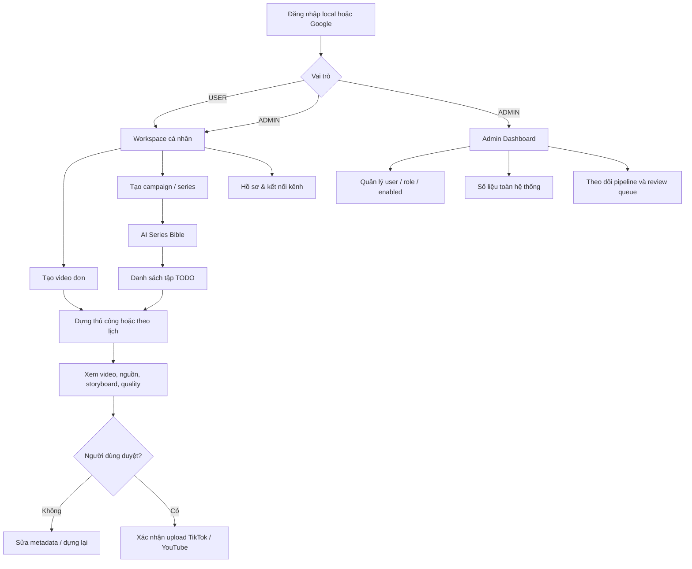

# User flows và phân quyền

## Sơ đồ vai trò

## Ma trận quyền

| Chức năng | USER | ADMIN |
|---|---:|---:|
| Workspace cá nhân | Có | Có |
| Tạo/sửa/xóa video của mình | Có | Có |
| Tạo campaign, Series Bible, scheduler | Có | Có |
| Kết nối TikTok/YouTube cá nhân | Có | Có |
| Xem Admin Dashboard | Không | Có |
| Danh sách toàn bộ user | Không | Có |
| Đổi role / khóa tài khoản | Không | Có |
| Xem toàn bộ task/campaign | Không | Có |
| Tự đăng không duyệt | Không | Không |

## Ví dụ: series trẻ em “Chó cảnh sát”

1. User tạo campaign với audience “Trẻ em 7–11 tuổi và phụ huynh”.
2. Series Planner tạo thế giới, nhân vật nhất quán, mục tiêu học tập, factual guardrails và ít nhất năm visual beats mỗi tập.
3. Research Agent tìm nguồn chính thức/nguồn gốc cho kiến thức về huấn luyện, an toàn và vai trò của chó nghiệp vụ.
4. Content Guard đánh dấu số liệu thiếu nguồn, claim coverage thấp, cảnh lặp và số cảnh chưa đủ.
5. Scheduler theo giờ/ngày chỉ dựng tập `TODO` tiếp theo.
6. Mỗi video quay về `DRAFT_REQUIRES_REVIEW`.
7. Người dùng xem video, khai báo “dành cho trẻ em” khi upload YouTube và tự xác nhận.

## Acceptance criteria

- User không thể truy cập `/admin` và `/api/admin/**`.
- Admin Dashboard không bị trộn với dashboard cá nhân.
- Campaign không sản xuất hai lần cùng một episode `TODO`.
- Campaign hết episode tự chuyển `COMPLETED`, tắt scheduler.
- Worker thiếu API key vẫn tạo Series Bible offline.
- Không upload TikTok/YouTube nếu thiếu `consent=true`.
- Không upload task chưa ở `DRAFT_REQUIRES_REVIEW` hoặc `DONE`.

